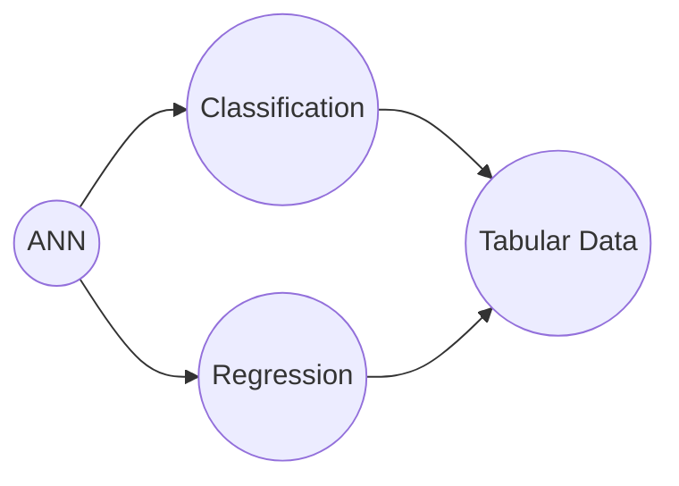

```mermaid
graph LR;
    A((ANN)) --> B((Classification))
    A((ANN)) --> C((Regression))
    B((Classification)) --> D((Tabular Data))
    C((Regression)) --> D((Tabular Data))
```

- Sequence of data does not matter for training.

`ANN`
```mermaid
graph LR;
  A(()) --> E(())
  B(()) --> F(())
  C(()) --> G(())
  D(()) --> H(())
```