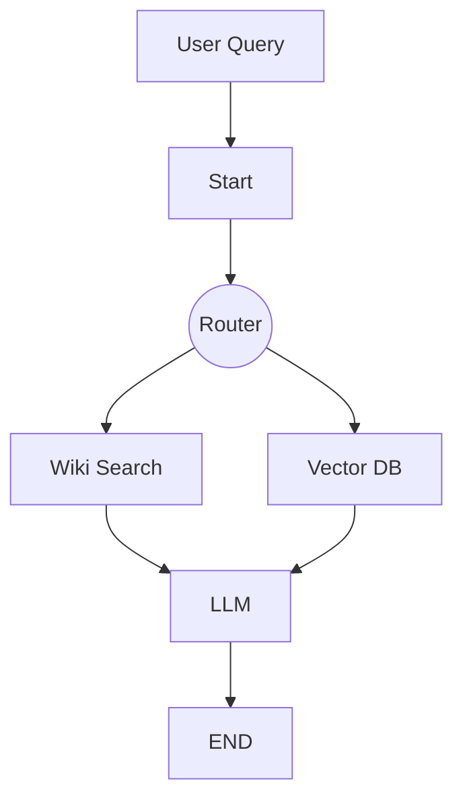

```mermaid
graph TD;
A[User Query] --> B[Start]
B[Start] --> C((Router))
C((Router)) --> D[Wiki Search]
C((Router)) --> E[Vector DB]
D[Wiki Search] --> F[LLM]
E[Vector DB] --> F[LLM]
F[LLM] --> G[END]
```