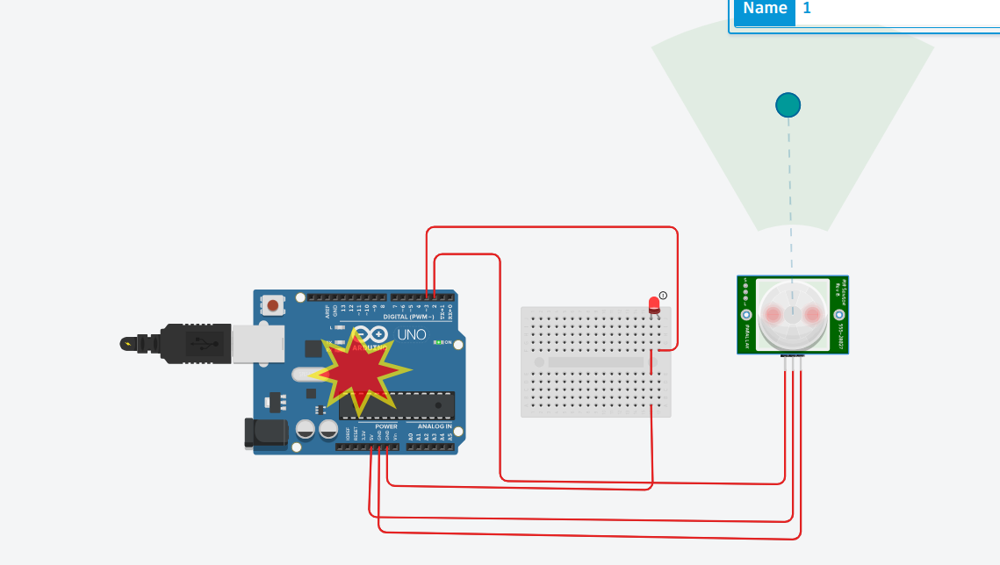

1. 
<br>


```cpp
int pin3=3,pin1=1,pin2=2;
void setup()
{
  pinMode(LED_BUILTIN, OUTPUT);
  pinMode(pin3,OUTPUT);
  pinMode(pin2,OUTPUT);
  pinMode(pin1,OUTPUT);
}

void loop()
{
  digitalWrite(LED_BUILTIN, HIGH);
  delay(1000); // Wait for 1000 millisecond(s)
  digitalWrite(LED_BUILTIN, LOW);
  delay(1000); // Wait for 1000 millisecond(s)
  digitalWrite(pin3,HIGH);
  delay(500);
  digitalWrite(pin3,LOW);
  delay(500);
  digitalWrite(pin2,HIGH);
  delay(500);
  digitalWrite(pin2,LOW);
  delay(500);
  digitalWrite(pin1,HIGH);
  delay(500);
  digitalWrite(pin1,LOW);
  delay(500);
}
```

2. 

```cpp
// C++ code
//
int red=3,yellow=1,green=2;
void setup()
{
  pinMode(LED_BUILTIN, OUTPUT);
  pinMode(red,OUTPUT);
  pinMode(green,OUTPUT);
  pinMode(yellow,OUTPUT);
}

void loop()
{

  digitalWrite(green,HIGH);
  digitalWrite(yellow,HIGH);
  delay(1000);
  digitalWrite(green,LOW);
  digitalWrite(yellow,LOW);
  delay(1000);
  digitalWrite(green,HIGH);
  digitalWrite(red,HIGH);
  delay(1000);
  digitalWrite(green,HIGH);
  digitalWrite(red,LOW);
  delay(1000);
  digitalWrite(yellow,HIGH);
  digitalWrite(green,HIGH);
  digitalWrite(red,HIGH);
  delay(1000);
  digitalWrite(yellow,LOW);
  digitalWrite(green,LOW);
  digitalWrite(red,LOW);
  delay(1000);
}

```


3. Knight Rider Effect:


```cpp
byte pin[11];
int delayTime=65;
int direction=1;
unsigned long long changeTime;
int currentLed=0;
void setup()
{
  pinMode(LED_BUILTIN, OUTPUT);
  digitalWrite(LED_BUILTIN,HIGH);
  for(int i=1;i<11;i++)
  {
  	pin[i]=i;
  }
  for(int i=1;i<11;i++)
  {
  	pinMode(pin[i],OUTPUT);
  }
  changeTime=millis();
}

void loop()
{
  if((millis()-changeTime)>delayTime)
  {
   changeLed();
    changeTime=millis();
  }
}

void changeLed()
{
  for(int i=0;i<11;i++)
  {
   digitalWrite(pin[i],LOW);
  }
  digitalWrite(currentLed,HIGH);
  currentLed+=direction;
  if(currentLed==8)direction=-1;
  if(currentLed==0)direction=1;
}

```

4. RGB Mood Lamp:


```cpp
float RGB1[3];
float RGB2[3];
float INC[3];
int redPin=1,greenPin=2,bluePin=3;
int red,green,blue;
void setup()
{
  Serial.begin(9600);
  randomSeed(analogRead(0));
  RGB1[0]=0;
  RGB1[1]=0;
  RGB1[2]=0;
  RGB2[0]=random(256);
  RGB2[1]=random(256);
  RGB2[2]=random(256);
}

void loop()
{
  randomSeed(analogRead(0));
  for(int i=0;i<3;i++)
  {
    INC[i]=(RGB1[i]-RGB2[i])/256;
    
  }
  for(int i=0;i<256;i++)
  {
    red=int(RGB1[0]);
    green=int(RGB1[1]);
    blue=int(RGB1[2]);
    analogWrite(redPin,red);
    analogWrite(greenPin,green);
    analogWrite(bluePin,blue);
    delay(100);
    RGB1[0]-=INC[0];
    RGB1[1]-=INC[1];
    RGB1[2]-=INC[2];
  }
  
  for(int i=0;i<3;i++)
  {
  	RGB2[i]=random(556)-300;
    RGB2[i]=constrain(RGB2[i],0,256);
    delay(500);
  }
  
}


```


5. LDR(Light Dependent Sensor) Sensor:


```cpp

void setup()
{
  Serial.begin(9600);
  
}

void loop()
{
  int data=analogRead(A0);
  Serial.println(data);
  delay(1000)
}

```

5. PIR (Passive Infrared sensor) Motion Sensor:


```cpp
int outputPin=3,inputPin=2,motion=LOW;
void setup()
{
  //Serial.begin(9600);
  pinMode(outputPin,OUTPUT);
  pinMode(inputPin,INPUT);
}

void loop()
{
  motion=digitalRead(inputPin);
  if(motion==HIGH)
  {
    digitalWrite(outputPin,HIGH);
  } 
  else
  {
  	digitalWrite(outputPin,LOW);
  }
   //digitalWrite(outputPin,HIGH);
}


```

6. TCS 3200 (Color Sensor):

<br>


```cpp
const int s0 = 8;

const int s1 = 9;

const int s2 = 12;

const int s3 = 11;

const int out = 10;

int redLed = 2;

int greenLed = 3;

int blueLed = 4;

int red = 0;

int green = 0;

int blue = 0;

void setup()

{

Serial.begin(9600);

pinMode(s0, OUTPUT);

pinMode(s1, OUTPUT);

pinMode(s2, OUTPUT);

pinMode(s3, OUTPUT);

pinMode(out, INPUT);

pinMode(redLed, OUTPUT);

pinMode(greenLed, OUTPUT);

pinMode(blueLed, OUTPUT);

digitalWrite(s0, HIGH);

digitalWrite(s1, HIGH);

}


void loop()

{

color();

Serial.print("R Intensity:");

Serial.print(red, DEC);

Serial.print(" G Intensity: ");

Serial.print(green, DEC);

Serial.print(" B Intensity : ");

Serial.print(blue, DEC);

//Serial.println();

if (red < blue && red < green && red < 20)

{

Serial.println(" - (Red Color)");

digitalWrite(redLed, HIGH); // Turn RED LED ON

digitalWrite(greenLed, LOW);

digitalWrite(blueLed, LOW);

}

else if (blue < red && blue < green)

{

Serial.println(" - (Blue Color)");

digitalWrite(redLed, LOW);

digitalWrite(greenLed, LOW);

digitalWrite(blueLed, HIGH); // Turn BLUE LED ON

}

else if (green < red && green < blue)

{

Serial.println(" - (Green Color)");

digitalWrite(redLed, LOW);

digitalWrite(greenLed, HIGH); // Turn GREEN LED ON

digitalWrite(blueLed, LOW);

}

else{

Serial.println();

}

delay(300);

digitalWrite(redLed, LOW);

digitalWrite(greenLed, LOW);
digitalWrite(blueLed, LOW);

}

void color()

{

digitalWrite(s2, LOW);

digitalWrite(s3, LOW);

//count OUT, pRed, RED

red = pulseIn(out, digitalRead(out) == HIGH ? LOW : HIGH);

digitalWrite(s3, HIGH);

//count OUT, pBLUE, BLUE

blue = pulseIn(out, digitalRead(out) == HIGH ? LOW : HIGH);

digitalWrite(s2, HIGH);

//count OUT, pGreen, GREEN

green = pulseIn(out, digitalRead(out) == HIGH ? LOW : HIGH);

}
```


7. Line Sensor:

```cpp
int ledPin = 9;

int line = 2;

int level = LOW;

int state = 0;

void setup()

{

pinMode(line,INPUT);

pinMode(ledPin,OUTPUT);

}

void loop()

{

state = digitalRead(line);

if(state == HIGH)

{

digitalWrite(ledPin,HIGH);

level = HIGH;

}

else{

digitalWrite(ledPin,LOW);

level=LOW;

}

}
```
8. Ultrasonic Sensor/ Sonar Sensor:
```cpp
#define trigPin 13

#define echoPin 12

#define ledPin 11

void setup() {

Serial.begin(9600);

pinMode(trigPin,OUTPUT);

pinMode(echoPin,INPUT);

pinMode(ledPin,OUTPUT);

}

void loop() {

long duration , distance;

digitalWrite(trigPin,LOW);

delayMicroseconds(2);

digitalWrite(trigPin,HIGH);

delayMicroseconds(10);

digitalWrite(trigPin,LOW);

duration = pulseIn(echoPin,HIGH);

distance = (duration/2) / 29.1;

if(distance<10)

{

digitalWrite(ledPin,HIGH);


}else{

digitalWrite(ledPin,LOW);

}

Serial.print(distance);

Serial.println("cm");

delay(1500);

}
```
9. IR Sensor:
```cpp
int ledPin = 9;

int inputPin = 2;

int object = LOW;

int stat = 0;

void setup()

{

pinMode(ledPin,OUTPUT);

pinMode(inputPin,INPUT);

}

void loop()

{

stat = digitalRead(inputPin);

if(stat == HIGH)

{

digitalWrite(ledPin,HIGH);

object = HIGH;

}else{

digitalWrite(ledPin,LOW);

object = LOW;

}

}
```
10. Touch Sensor:
```cpp
int ledPin = 9;

int inputPin = 2;

int touch = LOW;

int stat = 0;

void setup()

{

pinMode(ledPin,OUTPUT);

pinMode(inputPin,INPUT);

}

void loop()

{

stat = digitalRead(inputPin);

if(stat == HIGH)

{

digitalWrite(ledPin,HIGH);

touch = HIGH;

}else{

digitalWrite(ledPin,LOW);

touch = LOW;

}

}
```