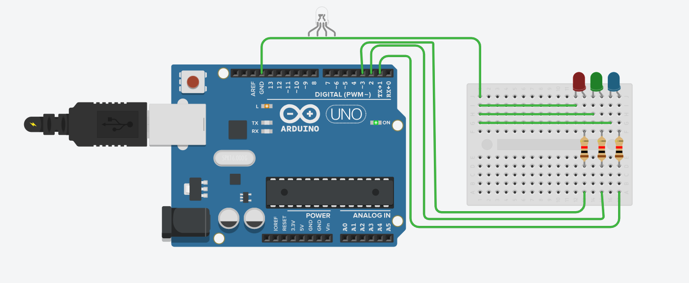

1. 

```cpp
int pin3=3,pin1=1,pin2=2;
void setup()
{
  pinMode(LED_BUILTIN, OUTPUT);
  pinMode(pin3,OUTPUT);
  pinMode(pin2,OUTPUT);
  pinMode(pin1,OUTPUT);
}

void loop()
{
  digitalWrite(LED_BUILTIN, HIGH);
  delay(1000); // Wait for 1000 millisecond(s)
  digitalWrite(LED_BUILTIN, LOW);
  delay(1000); // Wait for 1000 millisecond(s)
  digitalWrite(pin3,HIGH);
  delay(500);
  digitalWrite(pin3,LOW);
  delay(500);
  digitalWrite(pin2,HIGH);
  delay(500);
  digitalWrite(pin2,LOW);
  delay(500);
  digitalWrite(pin1,HIGH);
  delay(500);
  digitalWrite(pin1,LOW);
  delay(500);
}
```

2. 

```cpp
// C++ code
//
int red=3,yellow=1,green=2;
void setup()
{
  pinMode(LED_BUILTIN, OUTPUT);
  pinMode(red,OUTPUT);
  pinMode(green,OUTPUT);
  pinMode(yellow,OUTPUT);
}

void loop()
{

  digitalWrite(green,HIGH);
  digitalWrite(yellow,HIGH);
  delay(1000);
  digitalWrite(green,LOW);
  digitalWrite(yellow,LOW);
  delay(1000);
  digitalWrite(green,HIGH);
  digitalWrite(red,HIGH);
  delay(1000);
  digitalWrite(green,HIGH);
  digitalWrite(red,LOW);
  delay(1000);
  digitalWrite(yellow,HIGH);
  digitalWrite(green,HIGH);
  digitalWrite(red,HIGH);
  delay(1000);
  digitalWrite(yellow,LOW);
  digitalWrite(green,LOW);
  digitalWrite(red,LOW);
  delay(1000);
}

```


3. Knight Rider Effect:


```cpp
byte pin[11];
int delayTime=65;
int direction=1;
unsigned long long changeTime;
int currentLed=0;
void setup()
{
  pinMode(LED_BUILTIN, OUTPUT);
  digitalWrite(LED_BUILTIN,HIGH);
  for(int i=1;i<11;i++)
  {
  	pin[i]=i;
  }
  for(int i=1;i<11;i++)
  {
  	pinMode(pin[i],OUTPUT);
  }
  changeTime=millis();
}

void loop()
{
  if((millis()-changeTime)>delayTime)
  {
   changeLed();
    changeTime=millis();
  }
}

void changeLed()
{
  for(int i=0;i<11;i++)
  {
   digitalWrite(pin[i],LOW);
  }
  digitalWrite(currentLed,HIGH);
  currentLed+=direction;
  if(currentLed==8)direction=-1;
  if(currentLed==0)direction=1;
}

```

4. RGB Mood Lamp:


```cpp
float RGB1[3];
float RGB2[3];
float INC[3];
int redPin=1,greenPin=2,bluePin=3;
int red,green,blue;
void setup()
{
  Serial.begin(9600);
  randomSeed(analogRead(0));
  RGB1[0]=0;
  RGB1[1]=0;
  RGB1[2]=0;
  RGB2[0]=random(256);
  RGB2[1]=random(256);
  RGB2[2]=random(256);
}

void loop()
{
  randomSeed(analogRead(0));
  for(int i=0;i<3;i++)
  {
    INC[i]=(RGB1[i]-RGB2[i])/256;
    
  }
  for(int i=0;i<256;i++)
  {
    red=int(RGB1[0]);
    green=int(RGB1[1]);
    blue=int(RGB1[2]);
    analogWrite(redPin,red);
    analogWrite(greenPin,green);
    analogWrite(bluePin,blue);
    delay(100);
    RGB1[0]-=INC[0];
    RGB1[1]-=INC[1];
    RGB1[2]-=INC[2];
  }
  
  for(int i=0;i<3;i++)
  {
  	RGB2[i]=random(556)-300;
    RGB2[i]=constrain(RGB2[i],0,256);
    delay(500);
  }
  
}


```


