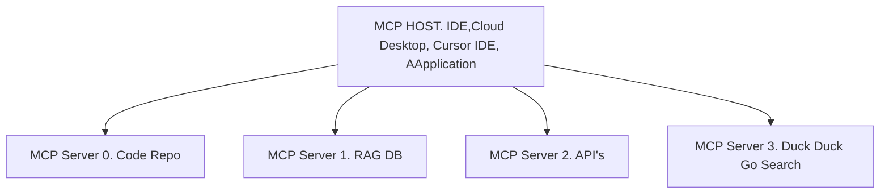

### MCP - Model Context Protocol


### Communication betwen the component

```mermaid
graph TD;
    A[I/P MCP Host] --> B[LLM]
    B[LLM] --> A[I/P MCP Host]
    A[I/P MCP Host] --> C[MCP Servers]
    A[I/P MCP Host] <-- C[MCP Servers]
```