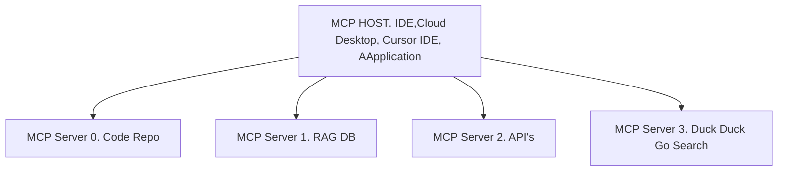

```mermaid
graph TB;
 A[MCP HOST. IDE,Cloud Desktop, Cursor IDE, AApplication] --> B[MCP Server 0. Code Repo]
 A[MCP HOST. IDE,Cloud Desktop, Cursor IDE, AApplication] --> C[MCP Server 1. RAG DB]
 A[MCP HOST. IDE,Cloud Desktop, Cursor IDE, AApplication] --> D[MCP Server 2. API's]
 A[MCP HOST. IDE,Cloud Desktop, Cursor IDE, AApplication] --> E[MCP Server 3. Duck Duck Go Search]
```