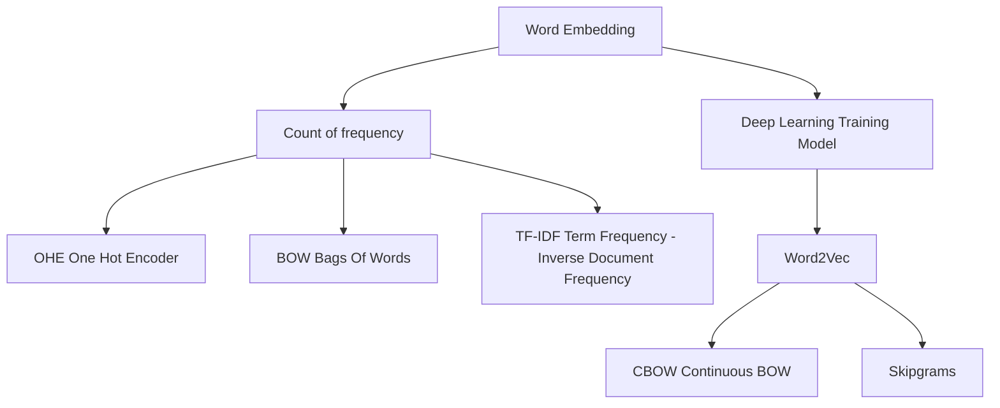

```mermaid
graph TD;
    A[Word Embedding] --> B[Count of frequency];
    A[Word Embedding] --> C[Deep Learning Training Model];
    B[Count of frequency] --> D[OHE One Hot Encoder];
    B[Count of frequency] --> E[BOW Bags Of Words];
    B[Count of frequency] --> F[TF-IDF Term Frequency - Inverse Document Frequency];
    C[Deep Learning Training Model] --> G[Word2Vec];
    G[Word2Vec] --> H[CBOW Continuous BOW];
    G[Word2Vec] --> I[Skipgrams];
```