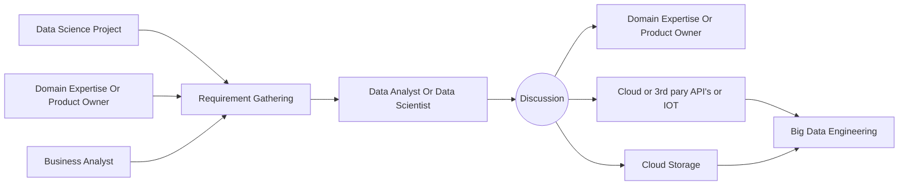
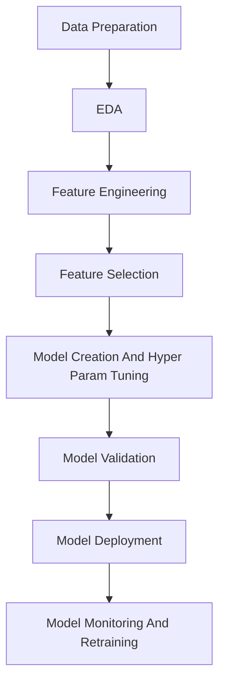

# Contents
- [Proxmox set up for gpu passthrough](#proxmox-set-up-for-gpu-passthrough)
- [Ubuntu server setup](#ubuntu-server--for-maxmimum-hardware-usage)
- [nividia gpu power limit in ubuntu server](#nividia-gpu-power-limit-in-ubuntu)
- [auto set gpu fan speed at boot](#auto-set-gpu-fan-speed-at-boot)
- [using podman ubuntu fedora as a podman os vs code ssh for lightweight dev environments](#using-podman--ubuntufedora-as-a-podman-os-vs-code-ssh-for-lightweight-dev-environments)
- [Run jupyterlab inside podman or docker with anaconda on ubuntu](#run-jupyterlab-inside-podman-with-anaconda-on-ubuntu)
- [CPU frequency control in ubuntu server](#cpu-frequency-control-in-ubuntu-server)
- Online resources. Colah's blog
- [Confusion Matrix](#confusion-matrix)
- [Data Science Project Task](#data-science-project-task)
- [Life Cycle Of Data Science Project](#life-cycle-of-data-science-project)
# Proxmox set up for gpu passthrough
#### 🛠️ Edit GRUB
- Open the GRUB configuration file:

```bash
nano /etc/default/grub
```

- Find the following line: `GRUB_CMDLINE_LINUX_DEFAULT="quiet"`

- Replace it with: 

```txt
GRUB_CMDLINE_LINUX_DEFAULT="quiet intel_iommu=on iommu=pt pcie_acs_override=downstream, multifunction nofb nomodeset video=vesafb:off,efifb:off"
```

#### 🔄 Update GRUB

```bash
update-grub
```

📦 Load Required Modules

- Edit the modules file:

```bash
nano /etc/modules
```

- Add the following lines:

```txt
vfio
vfio_iommu_type1
vfio_pci
vfio_virqfd
```

#### ⚙️ IOMMU Remapping

- a) Allow Unsafe Interrupts

```bash
nano /etc/modprobe.d/iommu_unsafe_interrupts.conf
```
- Add:

```bash
options vfio_iommu_type1 allow_unsafe_interrupts=1
```

- b) Ignore MSRs

```bash
nano /etc/modprobe.d/kvm.conf
```

- Add:

```bash
options kvm ignore_msrs=1
```

#### 🚫 Blacklist Host GPU Drivers

- Prevent the default GPU drivers from loading:

```bash
nano /etc/modprobe.d/blacklist.conf
```

- Add the following lines:

```bash
blacklist radeon
blacklist nouveau
blacklist nvidia
blacklist nvidiafb
```

#### 🎯 Bind GPU to VFIO

- a) Identify Your GPU

```bash
lspci -v
```

- b) Get Vendor IDs:

```bash
lspci -n -s 01:00.0
```

- c) Add IDs to VFIO

```bash
nano /etc/modprobe.d/vfio.conf
```

- Add the following line (replace with your actual IDs):

```bash
options vfio-pci ids=10de:1b80,10de:10f0 disable_vga=1
```

- ids=...: Lists device/vendor IDs of GPU and its audio function.
- disable_vga=1: Tells VFIO to disable VGA compatibility (important for multi-GPU systems).


#### 🔁 Final Update and Reboot

```bash
update-initramfs -u && reboot
```


- [List Of Contents](#setup)
# Ubuntu server ( For maxmimum hardware usage)

#### Install NVIDIA Driver

```bash
sudo ubuntu-drivers install
```


#### Auto-Set GPU Fan Speed at Boot
- N.B. No display output for this.
- 1. Enable Coolbits in X config: Ensure /etc/X11/xorg.conf has.

```bash
Section "Device"
    Identifier     "Device0"
    Driver         "nvidia"
    Option         "Coolbits" "4"
EndSection
```
- If it doesn’t exist:

```bash
sudo nvidia-xconfig --cool-bits=4
```

- 2. Install necessary packages

```bash
sudo apt update && apt install xserver-xorg-core xinit nvidia-settings -y
```

- 3. Create a script for auto fan speed: Create a file to start X and apply settings.

```bash
sudo nano /usr/local/bin/start-gpu-fan.sh
```
- Paste it:

```bash
#!/bin/bash

# Start X server in the background
X :0 &

# Wait for X to initialize
sleep 5

# Set display environment
export DISPLAY=:0
export XAUTHORITY=/root/.Xauthority

# Enable manual fan control and set to 100%
nvidia-settings -a "[gpu:0]/GPUFanControlState=1"
nvidia-settings -a "[fan:0]/GPUTargetFanSpeed=100"
```

- Make it executable:

```bash
sudo chmod +x /usr/local/bin/start-gpu-fan.sh
```

- 4. Create a systemd service
```bash
sudo nano /etc/systemd/system/gpu-fan.service
```

- Paste it:

```bash
#!/bin/bash
[Unit]
Description=Set NVIDIA GPU fan speed
After=multi-user.target

[Service]
Type=oneshot
ExecStart=/usr/local/bin/start-gpu-fan.sh
RemainAfterExit=true

[Install]
WantedBy=multi-user.target
```
- Enable the service:

```bash
sudo systemctl daemon-reexec
sudo systemctl enable gpu-fan.service
sudo reboot
```

- [List Of Contents](#setup)
# NIVIDIA Gpu Power Limit In Ubuntu

- 1. Create script:

```bash
sudo nano /usr/local/bin/gpu-power-limit.sh
```

- Add these lines
```bash
#!/bin/bash
nvidia-smi -pm 1
nvidia-smi -pl 120 # power can be set 120W , anyone can change it depend on his demand.
```

- 2. Make it executable:

```bash
sudo chmod +x /usr/local/bin/gpu-power-limit.sh
```
- 3. Create systemd service:

```bash
sudo nano /etc/systemd/system/gpu-power-limit.service
```

```bash
[Unit]
Description=Set GPU Power Limit
After=multi-user.target

[Service]
ExecStart=/usr/local/bin/gpu-power-limit.sh
Type=oneshot
RemainAfterExit=true

[Install]
WantedBy=multi-user.target
```

- 4. Enable it:

```bash
sudo systemctl daemon-reexec 
sudo systemctl enable gpu-power-limit.service
sudo systemctl start gpu-power-limit.service
systemctl status gpu-power-limit.service
```


- [List Of Contents](#setup)
# Using Podman + Ubuntu/Fedora As A Podman OS+ VS Code SSH for Lightweight Dev Environments

#### 🐳 Step 1: Run an Ubuntu Container

`For Ubuntu Container:`

```bash
podman run -it --name Ubuntu-Dev -v /home/customDir/:/home/ubuntu:z -p 2020:22 -p 80:8080 -p 3000:3000 -p 5000:5000 -p 8888:8888 ubuntu
```

`For Fedora Container:`

```bash
podman run -it --name Ubuntu-Dev -v /home/customDir/:/home/fedora:z -p 2020:22 -p 80:8080 -p 3000:3000 -p 5000:5000 -p 8888:8888 fedora
```

#### 🛠️ Step 2: Set Up SSH Server in the Container

`For Ubuntu Container:`

```bash
apt update && apt install -y openssh-server sudo curl git nano libatomic1
```

`For Fedora Container:`

```bash
dnf update && dnf install openssh-server git nano curl sudo 
```
- Set a password for root (only for local development):

```bash
passwd root
```
- Edit the SSH configuration:

```bash
nano /etc/ssh/sshd_config
```

- Make sure the following lines are present and uncommented:

```bash
PermitRootLogin yes
PasswordAuthentication yes
```

- Start the SSH server:
`For Ubuntu Container:`

```bash
service ssh start
```

`For Fedora Container:`

```bash
ssh-keygen -A
/usr/bin/sshd
```

- Set Up VS Code SSH Access

```bash
Host ubuntu-dev
  HostName 127.0.0.1
  Port 2020
  User root
```

- Or:

```bash
    ssh root@localhost -p 2020
```


- [List Of Contents](#setup)

# Run JupyterLab Inside Podman with Anaconda on Ubuntu

#### 🛠️ Step 1: Launch an Ubuntu Container with Podman
- Start a new Ubuntu container with port forwarding:

```bash
podman run -it --name Ubuntu -p 8888:8888 ubuntu
```
- `-p 8888:8888` exposes JupyterLab to your host.

#### 📦 Step 2: Install Dependencies Inside the Container

```bash
apt update && apt install -y wget
```

#### 🌐 Step 3: Download and Install Anaconda:
- Follow the anaconda installation doc for this.

#### 🧪 Step 4: Create and Activate a Conda Environment

```bash
conda create -n my-env python=3.11 -y
conda activate my-env
conda env list
```

#### 💡 Step 5: Install and Launch JupyterLab

- Install JupyterLab:

```bash
conda install jupyterlab
```

- Launch jupyter lab:

```bash
jupyter lab --ip=0.0.0.0 --port=8888 --no-browser --allow-root
```

- Use `--allow-root` because you're inside a container running as root. Otherwise, it not run perfectly.


- [List Of Contents](#setup)
# CPU frequency control in ubuntu server


```bash
sudo cpupower frequency -u 6.0GHz -d 3.0GHZ
```

#### Autostart up this programme:

```bash
[Unit]
Description=Lock Performance
After=network.target

[Service]
Type=oneshot
User=root
#ExecStart=
ExecStart=cpupower frequency-set -u 2.8GHz
ExecStart=cpupower frequency-set -d 2.8GHz
RemainAfterExit=yes

[Install]
WantedBy=multi-user.target
```

`Extra:`

- For repeated programme like as airflow server with astronomer

```bash
[Unit]
Description=algo-4
After=network.target

[Service]
User=root
ExecStart=
Restart=always
RestartSec=1

[Install]
WantedBy=multi-user.target
```

- Run without password:

```bash
sudo visudo
```

```bash
username ALL=(ALL) NOPASSWD: /usr/bin/cpupower
```

`Just run this command no password needed:`

```bash
sudo cpupower frequency-set -u 6.0GHz
```


# Sample yaml configuration for continue

```yml
name: Local Config
version: 1.0.0
schema: v1
models: 
  - name: "translategemma:latest"
    provider: "ollama"
    model: "translategemma:latest"
    apiBase: "http://localhost:11434"
    roles:
      - chat
      - edit
      - apply
```


# Set a default env in anaconda

```bash
conda config --show auto_activate
conda config --set auto_activate_base false
```

- Close the terminal and reopen terminal

```bash
echo "conda activate conda-env-3-12" >> ~/.bashrc
```

- Close the terminal and reopen terminal

# Remove a conda env
```bash
conda deactivate
conda remove --name conda-env-3-12 --all
```

# Confusion Matrix  
|Metric|Prediction|Actual Reality|Definition|Note|
|-------|----------|-------------|----------|----------|
|TP|True (Positive)|True (Positive)|Model correctly identified a positive case.|Success
|TN|False (Negative)|False (Negative)|Model correctly identified a negative case.|Success
|FP|True (Positive)|False (Negative)|Model said Yes, but it was actually No.|Type I Error (False Alarm)
|FN|False (Negative)|True (Positive)|Model said No, but it was actually Yes.|Type II Error (Missing Opportunity) 

#### $$Precision=\frac{TP}{TP+FP}$$
#### $$Recall=\frac{TP}{TP+FN}$$
#### $$Accuracy=\frac{TP}{TP+FP+FN+TN}$$

# Data Science Project task




# Life Cycle Of Data Science Project



# mlflow
- serving play --> input

```bash
mlflow ui
```

```python
import mlflow
mlflow.set_tracking_uri("http://127.0.0.1:5000")
mlflow.set_experiment(experiment_name="000 set up.ipynb")
with mlflow.start_run():
    model=LogisticRegression()
    model.fit(X_test,y_test)
    y_pred=model.predict(X_train)
    accuracy=accuracy_score(y_pred,y_train)
    signature=infer_signature(X_test,model.predict(X_train))
    mlflow.log_input(dataset=mlflow.data.from_numpy(X_test,"iris_dataset"),context="iris_dataset")
    mlflow.set_tag("Training Info","Basic LR model for iris dataset")
    model_info=mlflow.sklearn.log_model(
        sk_model=model,
        signature=signature,
        artifact_path="iris_model",
        input_example=X_test,
        registered_model_name="000 set up"
    )
```

`load model`

```python
model=mlflow.pyfunc.load_model(model_info.model_uri)

```