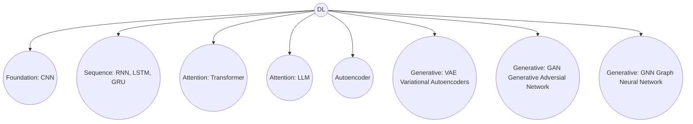
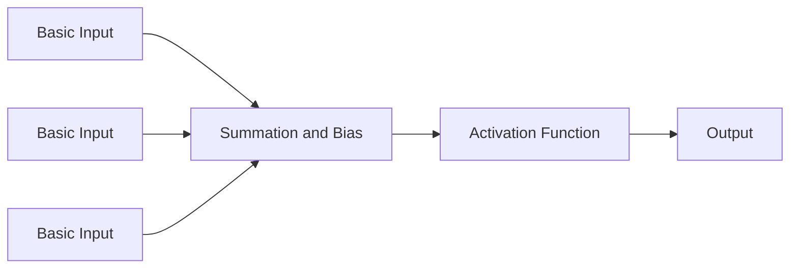
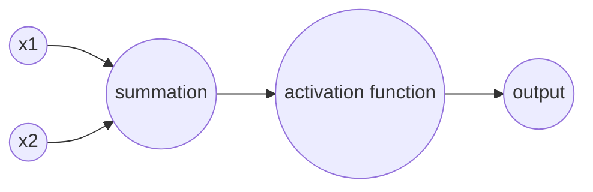
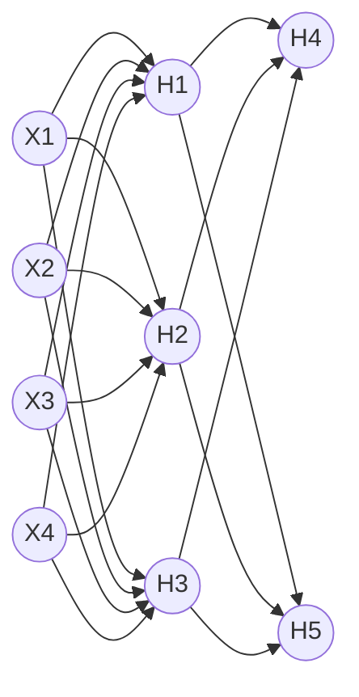

|Application|Neural Network |
|-----------|---------|
| Real state |Standard NN|
| Online advertising|Standard NN|
| Image Processing | CNN |
| Speech Recognition | RNN|
| Machine translation | RNN|
| Autonomous Driving | CNN+RNN|


#### Structured data:
#### Unstructured data: Image , text, audio, video
## Binary Classification:
- Output 0 or 1
- Notation 
$(x,y) ---> x\epsilon R^n, y \epsilon {0,1}$
## Logistic Regression: 
- uses sigmoid function to map input data to probability between 0 and 1. 
## Logistic Regression Cost Function
- uses binary cross entory
## Gradient Descent
- optimize algorithm which minimize the cost function 
## Derivatives
## Computation Graph
## Why DL is better than ML?
- Architecture
- Non linearity
- two or more spiral classification

## Polar co-ordinate vs Cartesian co-ordinate
- (r, $\theta$ ) vs (x,y)
- $r=(x^2+y^2)^\frac{1}{2}, \theta=tan^-1\frac{y}{x}$
- x=r $sin\theta$, y=r $cos\theta$

## 1943 McCulloch and Pitts

## Architecture of single layer perceptrons



## Weight updating formula
$$w_{new}=w_{old}+\eta(y-\hat{y})x_i$$

- $\eta$ learning rate
- y actual value
- $\hat{y}$ predicted value
- $y-\hat{y}$ error
- $x_i$ input vector 

> There is a similarity between Gradient descent and weight updating formula.
> Gradient descent.
$$w_{new}=w_{old}+\eta\frac{\delta W}{\delta W}$$

- Logical Gate: and, or, xor, nor


- AND Gate:

|case|$x_1$|$x_2$|Output|
|---|--|---|---|
|case 1|0|0|0|
|case 2|0|1|0|
|case 3|1|0|0|
|case 4|1|1|1|

here w1=1.2,w2=0.6, $\eta$=0.5,threshold=1
- neural network


case 1:
$w_1*x_1+w_2*x_2=0$

case 2:
$w_1*x_1+w_2*x_2=0.6 < threshold$

case 3:

for 1st epoch:

$w_1*x_1+w_2*x_2=1.2 > threshold$
here y=0 but $\hat y=1$ so, $w_{new1}=w_{old}+0.5*(-1)*1=0.7$ and $w_{new2}=w_{old}+0.5*(0)*0=0$

for 2nd epoch:

$\sum=w_1*x_1+w_2*x_2=0.7$ 

case 4:
$w_1*x_1+w_2*x_2=1.8 > threshold$


## Bias updating formula

$$b_{new}=b_{old}+\eta(y-\hat{y})$$


## Sample Perceptron Example

```py
import numpy as np
from sklearn.datasets import load_iris
from sklearn.model_selection import train_test_split  
from sklearn.preprocessing import StandardScaler
from sklearn.linear_model import Perceptron
from sklearn.metrics import accuracy_score,classification_report
iris=load_iris()
x=iris.data
y=iris.target
print(x)
print(y)
y_binary=np.where(y==0,0,1)
print(y_binary)
X_train,X_test,y_train,y_test=train_test_split(x,y_binary,test_size=0.2,random_state=42)
scaler=StandardScaler()
X_train=scaler.fit_transform(X_train)
X_test=scaler.transform(X_test)
perceptron=Perceptron(max_iter=1000,  eta0=0.01)
perceptron.fit(X_train,y_train)
y_pred_train=perceptron.predict(X_train)
y_pred_test=perceptron.predict(X_test)
print("Train acc:",accuracy_score(y_train,y_pred_train))
print("Test acc:",accuracy_score(y_test,y_pred_test))
```
## Why is XOR gate difficult for a single Perceptron?
- It is not linearly separable
## Which gate can be solved by a single-layer Perceptron?
- AND

## What does the learning rate control in weight update?
- Speed of learning

## In Perceptron weight update, which factor indicates the error?
- Actual Output - Predicted Output

## What is the key limitation of a single-layer Perceptron?
- Can not learn non linear boundaries


## Grokking Deep Learning By Andrew W. Trask

## What is perceptron?
- Supervised machine learning algorithm

## What is weight?
- Importance on input

## What is bias?
- base value of a model. start from 10 , in worth case but not fixed learn from data.
- High bias --> Model Underfitting. Too simple, not catch the pattern
- low bias --> Flexible, catch the pattern


## What is decision boundaries?
- Decision boundary: the line or surface that separates classes


## Gradient Descent

$y=mx+c$

$\hat{y}=mx_i+c$

$Loss=\sum^4_{i=1}(y-\hat{y})^2$

$Loss=\sum^4_{i=1}(y-mx_i-c)^2$

$Loss=\sum^4_{i=1}(y-10x_i-c)^2$ when m=10

$b_{new}=b_{old}-slope$ , when slope (+)ve

$b_{new}=b_{old}+slope$ , when slope (-)ve

$b_{new}=b_{old}-\eta * slope$

$b_{new}=b_{old}+\eta * slope$

$b_{new}=b_{old}-\eta*\frac{\delta y}{\delta x}$
$$
$$


```py
from sklearn.datasets import make_regression
import matplotlib.pyplot as plt
import numpy as np
from sklearn.model_selection import cross_val_score
X,y=make_regression(n_samples=100,n_features=1,n_informative=1,n_targets=1,noise=20,random_state=13)
plt.scatter(X,y)
from sklearn.model_selection import train_test_split
from sklearn.linear_model import LinearRegression
from sklearn.metrics import r2_score
X_train,X_test,y_train,y_test=train_test_split(X,y,test_size=0.2,random_state=42)
lr=LinearRegression()
lr.fit(X_train,y_train)
print(lr.coef_)
print(lr.intercept_)
y_pred=lr.predict(X_test)
print(r2_score(y_test,y_pred))

class GDRegressor:
    def __init__(self,learning_rate,epochs):
        self.m=lr.coef_
        self.c=-120
        self.epochs=epochs
        self.lr=learning_rate
    def fit(self,X,y):
        for i in range(self.epochs):
            loss_slope_c=-2*np.sum(y-self.m*X.ravel()-self.c)
            self.b=self.c-(self.lr*loss_slope_c)
            print(f"m= {self.m}, b={self.c}, epochs={i}")
    def predict(self,X):
        return self.m*X+self.c


gd=GDRegressor(0.001,50)
gd.fit(X_train,y_train)
print(r2_score(y_test,gd.predict(X_test)))
```

## Why perceptron algorithm use classed -1 and 1 instead of 0 and 1? explain how this choice affect perceptron update rule.
- Because 0 and 1 is not symmetric but -1 and 1 symmetric. If $f(x)=sign(w.x) $ and original class y. If model predict correct then y and f(x) will be same sign otherwise different. But if we use 0 and 1 in both case y=0 and for this model is correct or incorrect we can not define.

- Perceptron update rule, 
$$w_{new}=w_{old}+\eta (y-\hat{y})x_i$$

$$=> w_{new}=w_{old}+\eta (0-1)x_i$$

$$=> w_{new}=w_{old}+yx [more simplifying]$$

## Gradient descent usually updates weights by subtracting the gradient. Why does the perceptron update rule add the term ($\eta$,y,x) instead?

- Gradient descent generally used to reduce cost function. Target is reducing cost function, so need to go opposite of the slope. So subtraction,

$$w=w-\eta . \Delta(w)$$

- Perceptron update rule,

$$w_{new}=w_{old}+\eta (y-\hat{y})x_i$$

here, add or subtraction depend on $y-\hat{y}$, if $y-\hat{y}$=-1 then subtraction otherwise add. so, perceptron update rule add the term always.


## Explain in own words how the perceptron learning rule can be seen as a form of gradient descent. Also mention one limitation of the perceptron loss function.

## What is activation function?
- Activation function is a mathematical function that decide fired an aritificial neuron in a neural network or decide output will go next layer or not.

## Sigmoid activation function
$$\delta(x)=\frac{1}{1+e^{-x}}$$
- Threshold value 0.5 and after derivation 0.25.
- Output 0 to 1 whatever input does not matter.

## Differentiation of sigmoid function

$$\delta(x)=\frac{1}{1+e^{-x}}$$
$$=> \frac{d}{dx}\frac{1}{1+e^{-x}}$$
$$=> \frac{d}{dx}(1+e^{-x})^{-1}$$
$$=> -(1+e^{-x})^{-2} \frac{d}{dx} (1+e^{-x}) $$
$$=> -(1+e^{-x})^{-2} e^{-x} (-1)$$
$$=> \frac{e^{-x}}{(1+e^{-x})^2}$$
$$=> \frac{e^{-x}}{1+e^{-x}} \frac{1}{1+e^{-x}}$$
$$=> \frac{e^{-x}+1-1}{1+e^{-x}} .\delta (x)$$
$$=> (\frac{1+e^{-x}}{1+e^{-x}} - \frac{1}{1+e^{-x}}) .\delta (x)$$
$$=> (1-\delta(x)).\delta (x)$$

- Output 0 to 1

## ReLU (Rectified Linear Unit) activation function
$$f(x)=max(0,x) where, x-> \inf $$
- Output range 0 to infinity.

## Tanh activation function
$$\tan h=\frac{e^{-x}-e^{x}}{e^{-x}+e^{x}}$$
$$\frac{d}{dx}(\tan h)=1- \tan^2h$$

- Output -1 to 1

## Softmax activation function

$$\delta (z_i)=\frac{e^{z_i}}{\sum^k_i e^{z_j}}$$
- Output 0 to 1.

## BCE Loss Function
## NN Notation
