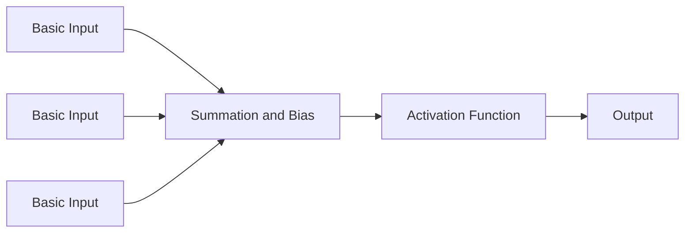
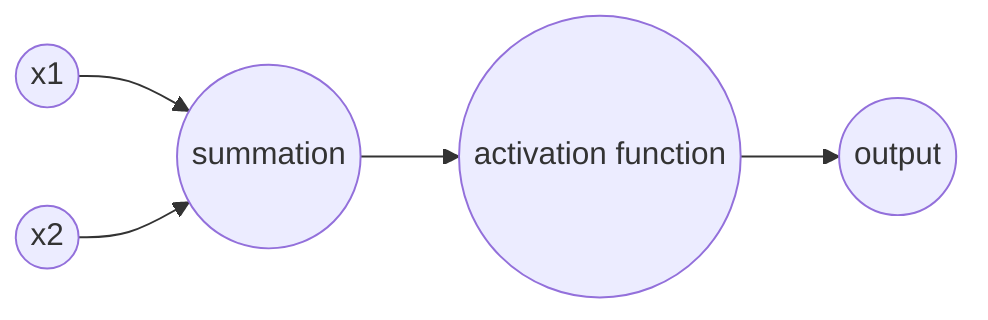

|Application|Neural Network |
|-----------|---------|
| Real state |Standard NN|
| Online advertising|Standard NN|
| Image Processing | CNN |
| Speech Recognition | RNN|
| Machine translation | RNN|
| Autonomous Driving | CNN+RNN|


#### Structured data:
#### Unstructured data: Image , text, audio, video
## Binary Classification:
- Output 0 or 1
- Notation 
$(x,y) ---> x\epsilon R^n, y \epsilon {0,1}$
## Logistic Regression: 
- uses sigmoid function to map input data to probability between 0 and 1. 
## Logistic Regression Cost Function
- uses binary cross entory
## Gradient Descent
- optimize algorithm which minimize the cost function 
## Derivatives
## Computation Graph
## Why DL is better than ML?
- Architecture
- Non linearity
- two or more spiral classification

## Polar co-ordinate vs Cartesian co-ordinate
- (r,$\theta$) vs (x,y)
- $r=(x^2+y^2)^\frac{1}{2}, \theta=tan^-1\frac{y}{x}$
- x=r $sin\theta$, y=r $cos\theta$

## 1943 McCulloch and Pitts

## Architecture of perceptrons




## Weight updating formula
$$w_new=w_{old}+\eta(y-\hat{y})x_i$$

- $\eta$ learning rate
- y actual value
- $\hat{y}$ predicted value
- $y-\hat{y}$ error
- $x_i$ input vector 

> There is a similarity between Gradient descent and weight updating formula.
> Gradient descent.
$$w_{new}=w_{old}+\eta\frac{\delta W}{\delta W}$$

- Logical Gate: and, or, xor, nor


- AND Gate:

|case|$x_1$|$x_2$|Output|
|---|--|---|---|
|case 1|0|0|0|
|case 2|0|1|0|
|case 3|1|0|0|
|case 4|1|1|1|

here w1=1.2,w2=0.6, $\eta$=0.5,threshold=1
- neural network


case 1:
$w_1*x_1+w_2*x_2=0$

case 2:
$w_1*x_1+w_2*x_2=0.6 < threshold$

case 3:

for 1st epoch:

$w_1*x_1+w_2*x_2=1.2 > threshold$
here y=0 but $\hat y=1$ so, $w_{new1}=w_{old}+0.5*(-1)*1=0.7$ and $w_{new2}=w_{old}+0.5*(0)*0=0$

for 2nd epoch:

$\sum=w_1*x_1+w_2*x_2=0.7$ 

case 4:
$w_1*x_1+w_2*x_2=1.8 > threshold$


## Bias updating formula

$$b_new=b_{old}+\eta(y-\hat{y})$$


## Sample Perceptron Example

```py
import numpy as np
from sklearn.datasets import load_iris
from sklearn.model_selection import train_test_split  
from sklearn.preprocessing import StandardScaler
from sklearn.linear_model import Perceptron
from sklearn.metrics import accuracy_score,classification_report
iris=load_iris()
x=iris.data
y=iris.target
print(x)
print(y)
y_binary=np.where(y==0,0,1)
print(y_binary)
X_train,X_test,y_train,y_test=train_test_split(x,y_binary,test_size=0.2,random_state=42)
scaler=StandardScaler()
X_train=scaler.fit_transform(X_train)
X_test=scaler.transform(X_test)
perceptron=Perceptron(max_iter=1000,  eta0=0.01)
perceptron.fit(X_train,y_train)
y_pred_train=perceptron.predict(X_train)
y_pred_test=perceptron.predict(X_test)
print("Train acc:",accuracy_score(y_train,y_pred_train))
print("Test acc:",accuracy_score(y_test,y_pred_test))
```
## Why is XOR gate difficult for a single Perceptron?
- It is not linearly separable
## Which gate can be solved by a single-layer Perceptron?
- AND

## What does the learning rate control in weight update?
- Speed of learning

## In Perceptron weight update, which factor indicates the error?
- Actual Output - Predicted Output

## What is the key limitation of a single-layer Perceptron?
- Can not learn non linear boundaries

## Grokking Deep Learning By Andrew W. Trask

## What is perceptron?
- Supervised machine learning algorithm

## What is weight?
- Importance on input

## What is bias?
- base value of a model. start from 10 , in worth case but not fixed learn from data.
- High bias --> Model Underfitting. Too simple, not catch the pattern
- low bias --> Flexible, catch the pattern


