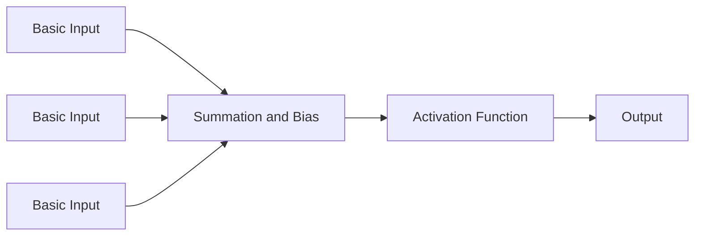

|Application|Neural Network |
|-----------|---------|
| Real state |Standard NN|
| Online advertising|Standard NN|
| Image Processing | CNN |
| Speech Recognition | RNN|
| Machine translation | RNN|
| Autonomous Driving | CNN+RNN|


#### Structured data:
#### Unstructured data: Image , text, audio, video
## Binary Classification:
- Output 0 or 1
- Notation 
$(x,y) ---> x\epsilon R^n, y \epsilon {0,1}$
## Logistic Regression: 
- uses sigmoid function to map input data to probability between 0 and 1. 
## Logistic Regression Cost Function
- uses binary cross entory
## Gradient Descent
- optimize algorithm which minimize the cost function 
## Derivatives
## Computation Graph
## Why DL is better than ML?
- Architecture
- Non linearity
- two or more spiral classification

## Polar co-ordinate vs Cartesian co-ordinate
- (r,$\theta$) vs (x,y)
- $r=(x^2+y^2)^\frac{1}{2}, \theta=tan^-1\frac{y}{x}$
- x=r $sin\theta$, y=r $cos\theta$

## 1943 McCulloch and Pitts

## Architecture of perceptrons




## Weight updating formula
$$w_new=w_{old}+\eta(y-\hat{y})x_i$$

## Bias updating formula

$$b_new=b_{old}+\eta(y-\hat{y})$$


## Sample Perceptron Example

```py
import numpy as np
from sklearn.datasets import load_iris
from sklearn.model_selection import train_test_split  
from sklearn.preprocessing import StandardScaler
from sklearn.linear_model import Perceptron
from sklearn.metrics import accuracy_score,classification_report
iris=load_iris()
x=iris.data
y=iris.target
print(x)
print(y)
y_binary=np.where(y==0,0,1)
print(y_binary)
X_train,X_test,y_train,y_test=train_test_split(x,y_binary,test_size=0.2,random_state=42)
scaler=StandardScaler()
X_train=scaler.fit_transform(X_train)
X_test=scaler.transform(X_test)
perceptron=Perceptron(max_iter=1000,  eta0=0.01)
perceptron.fit(X_train,y_train)
y_pred_train=perceptron.predict(X_train)
y_pred_test=perceptron.predict(X_test)
print("Train acc:",accuracy_score(y_train,y_pred_train))
print("Test acc:",accuracy_score(y_test,y_pred_test))
```